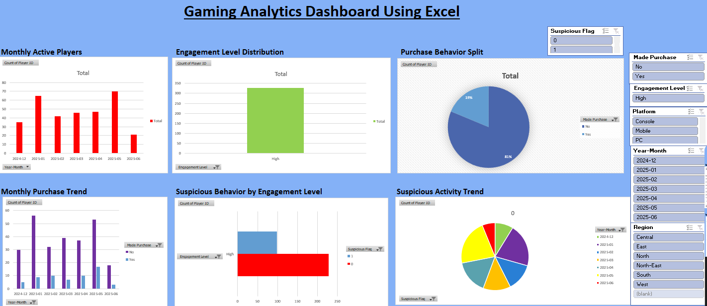

# Gaming Platform Player Transaction Analysis - Microsoft Excel🎮📊

---

> An end-to-end data analysis project exploring player behavior, in-game monetization patterns, platform performance, and suspicious activity detection across 500 gaming sessions spanning 5 titles.

---

## 📌 Project Overview

This case study analyzes a simulated gaming dataset to uncover actionable insights around player engagement, revenue generation, session quality, and anomaly detection. The analysis spans 5 games, 3 platforms, and 6 geographic regions — providing a multi-dimensional view of a gaming ecosystem.

---

## 📸 Dashboard Preview



> **Interactive Excel Dashboard** featuring 6 charts with slicers for Suspicious Flag, Made Purchase, Engagement Level, Platform, Year-Month, and Region. Charts include Monthly Active Players, Engagement Level Distribution, Purchase Behavior Split, Monthly Purchase Trend, Suspicious Behavior by Engagement Level, and Suspicious Activity Trend.

---

## 📊 Dataset Summary

| Attribute | Details |
|---|---|
| **Records** | 500 gaming sessions |
| **Time Period** | December 2024 – June 2025 |
| **Games** | BattleZone, Zombie Rush, SpeedX, Clash of Realms, Empire Wars |
| **Platforms** | Console, Mobile, PC |
| **Regions** | Central, East, North, North-East, South, West |
| **Key Metrics** | Session Duration, In-Game Purchases, Level Reached, Player Type |

### Columns
| Column | Description |
|---|---|
| Session ID | Unique identifier per session |
| Player ID | Unique player identifier |
| Game Name | One of 5 titles |
| Platform | Console / Mobile / PC |
| Region | Geographic region of player |
| Session Date | Date of session |
| Session Duration (min) | Length of gaming session |
| In-Game Purchase ($) | Revenue generated per session |
| Purchase Type | Boosters / Battle Pass / Skins / Subscriptions |
| Session Status | Completed / Crashed / Exited Early / Incomplete |
| Player Type | Free or Paid player |
| Level Reached | Highest level reached in session |
| Is Suspicious | Flag for anomalous activity |

---

## 🔍 Analysis Performed

### 1. Player Segmentation
- Free vs. Paid player distribution (352 Free : 148 Paid)
- Engagement depth by player type (session duration, level reached)
- Purchase behavior patterns across player segments

### 2. Revenue Analysis
- Total in-game revenue: **$2,631.27** across 500 sessions
- Purchase type breakdown by region using pivot tables
- Revenue concentration by platform and game title

### 3. Session Quality Assessment
- Session completion rate: **72%** (360 of 500 sessions completed)
- Crash & drop-off analysis (Crashed: 43, Exited Early: 52, Incomplete: 45)
- Session duration distribution across platforms

### 4. Regional Purchase Behavior
- Cross-tab of Region × Purchase Type (Battle Pass, Boosters, Skins, Subscriptions)
- North region leads with 96 sessions; West follows with 93
- Free-to-play dominance across all regions

### 5. Suspicious Activity Detection
- **20.6%** of sessions flagged as suspicious (103 of 500)
- Identification of patterns linked to anomalous play behavior
- Free player vs. Paid player distribution within suspicious sessions

---

## 🛠️ Tools & Techniques

- **Microsoft Excel** — Data cleaning, pivot tables, conditional formatting, dashboard creation
- **Data Analysis** — Segmentation, aggregation, cross-tabulation
- **Visualization** — Charts, slicers, and summary dashboards

---

## 📁 Repository Structure

```
gaming-session-analytics/
│
├── data/
│   └── Gaming_Case_Study_Excel_Dataset.xlsx   # Raw + analyzed dataset
│
├── README.md                                   # Project documentation
```

---

## 💡 Key Findings

- The **North** and **West** regions drive the most session volume, making them priority targets for engagement campaigns
- **20.6% suspicious session rate** is a significant trust and integrity risk requiring monitoring infrastructure
- Paid players represent only **29.6% of users** but likely drive a disproportionate share of revenue — a classic freemium dynamic
- **72% session completion** rate indicates reasonable stability, but the **8.6% crash rate** signals platform reliability issues worth addressing
- **Free players (396/500 sessions had no purchase)** — conversion optimization is the single largest revenue growth lever

---

## 🚀 Getting Started

1. Download `Gaming_Case_Study_Excel_Dataset.xlsx`
2. Open in Microsoft Excel (2016 or later recommended)
3. Navigate to the **Dashboard** sheet for visual summaries
4. Use the **Tables** sheet for pivot-based regional breakdowns
5. Raw data is in the **Data** sheet — fully filterable

---

## 👤 Author

**Saikiranreddy**

linkedin.com/in/saikiran-r717(url) | [saikiranr717@gmail.com](url) |

---

